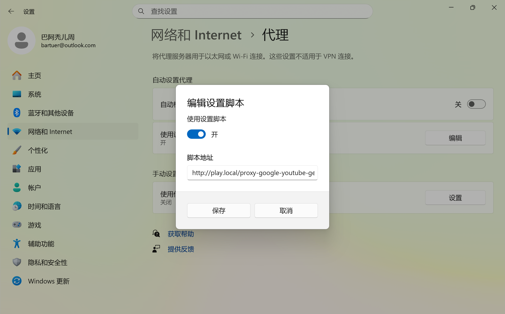

# Windows HTTP→SOCKS 代理配置指南

## 为什么 redsocks 不能作为 HTTP 前置代理
- Redsocks 的定位是通过 iptables（Linux NAT）做透明 TCP 重定向，它并不是一个面向客户端的 HTTP 前置代理。
- 在 WSL2 中，iptables 规则只作用于 Linux 侧流量；它并不会让 Windows 防火墙转发端口或为 Windows 应用执行 NAT。
- 因此，想用 redsocks 把 Windows 发出的 HTTP 请求转换为 SOCKS5（`-x` 参数）是不可行的，除非你能在 Linux 内部透明地重定向这类流量。

## PAC 文件必须通过 HTTP 提供，不能使用 file://
- Windows 的代理设置经常会忽略或者无法加载来自 `file://` 的 PAC 文件，原因可能是权限、服务上下文或缓存等限制。
- 解决方法：在 WSL 中通过本地 Web 服务器提供 PAC 文件（例如 Python 的 `http.server`），然后在 Windows 代理设置里填写 HTTP URL，比如 `http://<WSL-IP>:8000/proxy-google-youtube-gemini.pac`。

### Windows 代理配置步骤



1. 打开 **设置 → 网络和 Internet → 代理**。
2. 在 *自动代理设置* 中打开 **使用设置脚本**。
3. 把 PAC 地址填写为 `http://play.local/proxy-google-youtube-gemini.pac`。
4. 点击 **保存**。
5. 确保 *自动检测设置* 以及 *手动代理设置* 下的所有选项都保持 **关闭**。
6. 重新打开代理设置页面，或者访问 `edge://net-internals/#proxy`，确认 PAC URL 生效。

## 代理链路概览
```
play.local:80
   ↓
PAC 文件（通过 HTTP 提供）
   ↓
HTTP 代理（Privoxy）:8081
   ↓
SOCKS5 代理（azuresshproxy）:8080
```
- Windows 应用读取 PAC 文件，按需把特定流量导向 Privoxy（监听 8081 的 HTTP 代理），Privoxy 再转发给 SOCKS5 代理（8080）。

- 打开 [http://p.p](http://p.p) 或 [http://config.privoxy.org](http://config.privoxy.org) 验证 Privoxy 是否正常工作。如果页面无法加载，请检查 PAC、代理设置和 Privoxy 状态。

## 如何检查浏览器的代理诊断信息

- 在 Edge 中访问 [edge://net-internals/#proxy](edge://net-internals/#proxy)，可以查看并重新应用代理设置。

## 如何确认代理端口正在监听
- 在 WSL 中运行：
```bash
ss -ltnp | grep -E ':8080|:8081'
ps -ax|grep privoxy
```
- 你应当能看到 Privoxy 监听 8081，ssh/azure-proxy 监听 8080。

## 后续可改进项
- 为 nginx 增加针对 8080 和 8081 的健康检查，便于监控。
- Privoxy 已经是守护进程；可以把 `ssh -D` 的 SOCKS5 隧道包装成守护进程（例如 systemd 服务或监督脚本），提升可靠性。

## 服务监管与健康检查

- systemd 中的 `azuresshproxy.service` 负责保持 SOCKS5 隧道（`/bin/azure-proxy`）常驻运行。可以通过以下命令启用：

   ```bash
   sudo systemctl enable --now azuresshproxy.service
   ```

- Nginx 对外提供 `http://play.local/check`：
   - 探测 `127.0.0.1:8081` 上的 `privoxy`
   - 探测 `127.0.0.1:8080` 上的 `azuresshproxy`

   如果发现服务中断，健康检查会尝试执行 `systemctl restart …`，并在 JSON 响应中汇报结果。可以使用 `curl --noproxy '*' http://play.local/check` 或直接访问 [http://play.local/check](http://play.local/check) 来查看当前状态。

---
这一套方案让 Windows 能借助 WSL2 稳定地实现 HTTP→SOCKS 代理转换，既能通过 PAC 做精细流量调度，又便于诊断和维护。